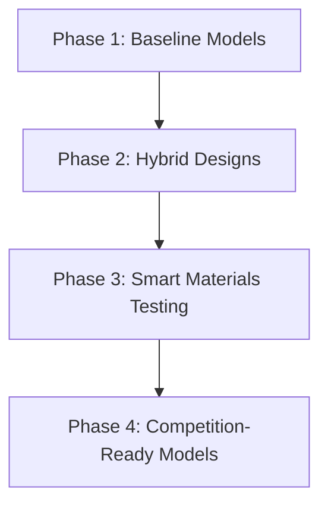

# ✈️ PAPER PLANE PROJECT 

*A Scientific and Creative Pursuit of Perfecting Paper Aviation*

---

## 🎯 Project Overview  
This open-source initiative aims to engineer **the ultimate paper airplane** through systematic experimentation, iterative design, and data-driven analysis. We're exploring the intersection of aerodynamics, material science, and artistic expression to dominate three key performance categories:

**🏆 Core Objectives**  
1. **Maximum Distance**  
   Target: 100+ feet straight-line flight  
   Current Record: 78.3 feet  

2. **Extended Air Time**  
   Target: 15+ seconds sustained flight  
   Current Record: 9.8 seconds  

3. **Aesthetic Excellence**  
   Developing visually striking designs that maintain flight performance  

---

## 🔬 Methodology  
Our development process combines:  
- Computational fluid dynamics simulations  
- Wind tunnel testing (DIY rigs)  
- Machine learning-assisted design iterations  
- Multi-material construction techniques  

---

## 📅 Roadmap (Next Phase)  


**Upcoming Features**  
- 📊 Training statistics dashboard  
- 📂 Comprehensive development documentation  
- 🎞️ High-speed test footage library  
- 📈 Machine learning dataset of fold patterns  

---

## 🛠️ Tech Stack  
```python
class PaperPlane:
    def __init__(self):
        self.materials = ["60-100gsm paper", "biodegradable adhesives"]
        self.sensors = ["Arduino nano trackers", "OpenCV pose estimation"]
        self.analytics = ["Python", "Jupyter Lab", "Tableau"]
```

---

## 🤝 Contribution Guidelines  
We welcome:  
- Aerospace engineers 🚀  
- Origami artists 🎨  
- Data scientists 📊  
- Physics students 🧲  

*First-time contributors: See our Good First Issues label*

---

## 📜 License  
This project operates under [MIT License](LICENSE.md), with all designs and data publicly available for non-commercial use.
